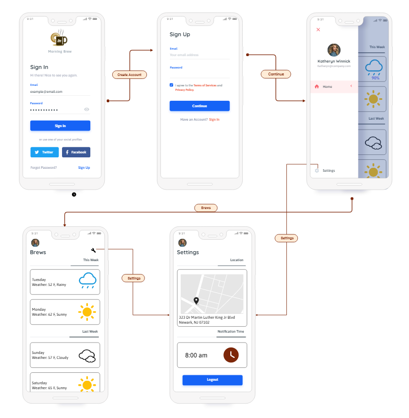
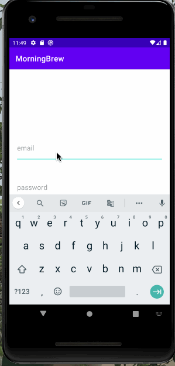
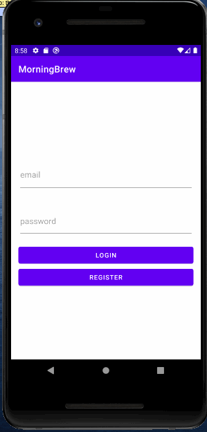
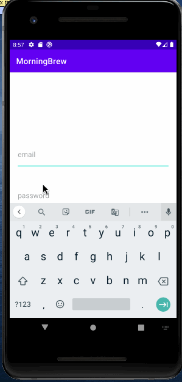

# Morning Brew

## Table of Contents
1. [Overview](#Overview)
1. [Product Spec](#Product-Spec)
1. [Wireframes](#Wireframes)
2. [Schema](#Schema)
3. [Video Walkthroughs](#Video-Walkthrough)

## Overview
### Description
Morning Brew alerts individuals daily by informing them of the current weather for a specified location at a specified time.

### App Evaluation
- **Category:** Lifestyle
- **Mobile:** This app is primarily developed for mobile. A mobile app will allow clients more convenience to use it whenever they wake up in the morning. Thus, it is more practical to develop this as a mobile app than a desktop app in order for it to suit its purpose.
- **Story:** The app delivers daily notifications regarding weather for the day. The user can see past notifications, change the time they receive daily notifications, and change the weather's location.
- **Market:** It can be marketed to anyone interested in changing or improving their lifestyle. This app also appeals to anyone who wants to know the weather every day without checking their weather app.
- **Habit:** This app will be used every day, once a day. Because the app's purpose is to notify the user every day at a specified time, the user will interact with the app at least once a day.
- **Scope:** In the beginning, the app's functionality is simple and alerts the user with the weather. Its usage could then be broadened to include a calendar and a to-do list. Adding a calendar and a to-do list would allow users to organize their time in one application, establishing its goal as a lifestyle app. To expand its functionality, even more, the Optional Nice-to-have Stories can be implemented.

## Product Spec

### 1. User Stories (Required and Optional)

**Required Must-have Stories**

* [x] User can register a new account
* [x] User can login
* [x] User can set location for weather
* [x] User can set time for daily notification
* [x] User can see previous notifications
* [ ] User receives daily notification 

**Optional Nice-to-have Stories**

* User can adjust when they recieve notifications(Ex. Mon-Fri)
* User can set profile picture
* User can set location to auto
* Add more content into notifcation
  * Joke of the Day
  * Coffee fact of the day
  * Daily Playlist
* User can opt in for email notification

### 2. Screen Archetypes

* Login
  * User can login
* Register
  * User can register a new account
  * User can set location for weather
  * User can set time for daily notification
* Stream
  * User can see previous notifications
* Settings
  * User can set location for weather
  * User can set time for daily notification

### 3. Navigation

**Tab Navigation** (Tab to Screen)

* Stream
* Settings

**Flow Navigation** (Screen to Screen)

* Login -> Stream
* Register -> Stream
* Stream -> Settings
* Settings -> Stream
* Settings -> Login
 
    
## Wireframes

### [BONUS] Digital Wireframes & Mockups



### [BONUS] Interactive Prototype

## Schema 
### Models

#### Brew

| Property | Type | Description |
|--- | --- | --- |
|objectId | String | unique Id for the brew (default field) |
|user| Pointer to User | Brew attached to User (default field|
|createdAt| DateTime | Date and Time of Creation (default field)|
|weatherHigh| int | High temp of the day (default field)|
|weatherLow| int | Low temp of the day (default field)|
|weatherDes| String | one word description of the weather (default field)|

#### User

| Property | Type | Description |
|--- | --- | --- |
|objectId | String | unique Id for the User (default field) |
|name| String | name of the User |
|username| String | Username of the user (default field) |
|password| String | Password of the user (hidden field) |
|profilePic| File | Profile pic of the user|
|location|String|Coordinates of the User|
|time| String| user set time for notifications|
|createdAt|DateTime| Date and Time of Creation (default field)|

### Networking
#### List of network requests by screen
 * Registering Screen 
    * (Create/POST) create a new user 
      ```java
      User user= new User();
      user.setName(name);
      user.setUserName(username);
      user.setPassword(password);
      user.setProfilePic(profilePicFile);
      user.saveInBackground(new SaveCallback() {
          @Override
          public void done(ParseException e) {
              if (e != null){
                  Log.e(TAG, "Error saving brew in backend", e);
                  return;
              }
          //TODO: Login user and redirect to the brews screen
          }
      });
      ```
 * Stream Screen 
    * (Read/GET) Query all brew object where currentUser is attached
    ```java
     ParseQuery<brew> query = ParseQuery.getQuery(Brew.class);
     query.include(Brew.KEY_USER);
     query.setLimit(20);
     query.whereEqualTo(Brew.KEY_USER, ParseUser.getCurrentUser());
     query.addDescendingOrder(Brew.KEY_CREATED_KEY);
     query.findInBackground(new FindCallback<Brew>() {
         @Override
         public void done(List<Brew> Brews, ParseException e) {
             if (e!= null){
                 Log.e(TAG,"Couldn't find content",e);
                 return;
             }
             
             //TODO: Do something with Brews
     });
    ```
     * (Create/POST) Create a new Brew object at the set time 
     ```java
      Brew brew= new Brew();
      brew.setWeatherHigh(high);
      brew.setWeatherLow(low);
      brew.setWeatherDes(des);
      brew.setUser(currentUser);
      brew.saveInBackground(new SaveCallback() {
          @Override
          public void done(ParseException e) {
              if (e != null){
                  Log.e(TAG, "Error saving brew in backend", e);
                  return;
              }
          //TODO: Send Brew as Notification and add it to the Brews Feed
          }
      });
     ```
 * Settings Screen 
    * (Update/PUT) Update user location
    * (Update/PUT) Update time of notification 
    ```java
    ParseQuery<ParseObject> query = ParseQuery.getQuery(User.class);
    query.whereEqualTo(Brew.KEY_USER, ParseUser.getCurrentUser());
    query.getInBackground(objectId, new GetCallback<ParseObject>() {
      public void done(ParseObject User.class, ParseException e) {
        if (e == null) {
            //TODO: Update location and time
        }
      }
    });
    ```

## Video Walkthrough
### User can Set location and time in settings activity 


### User can register a new account:



### User can login with an existing account:


